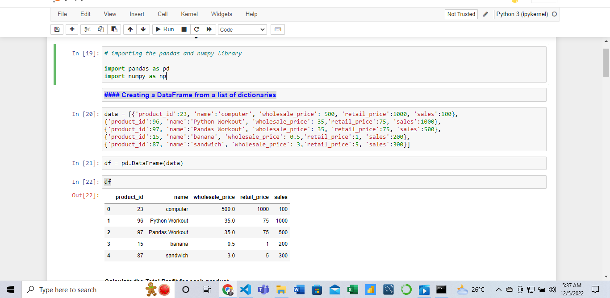

# First-Class-Project-on-Numpy-and-Pandas
Using Numpy and Pandas to find revenue generated and total expenses of an organization 

## 👋 **ASSIGNMENT INSTRUCTION**
---
1. Creat a DataFrame from the lists below

[{'product_id':23, 'name':'computer', 'wholesale_price': 500, 'retail_price':1000, 'sales':100}, 

{'product_id':96, 'name':'Python Workout', 'wholesale_price': 35,'retail_price':75, 'sales':1000},

{'product_id':97, 'name':'Pandas Workout', 'wholesale_price': 35, 'retail_price':75, 'sales':500},

{'product_id':15, 'name':'banana', 'wholesale_price': 0.5,'retail_price':1, 'sales':200},

{'product_id':87, 'name':'sandwich', 'wholesale_price': 3,'retail_price':5, 'sales':300}]

💻**Note**

Create a python file to contain your solution

## 📝**GUIDELINES**
---
**Step 1**:

Calculate the total profit for each of the product using the formula
net_revenue_per_capital = (retail_price - wholesale_prise)*sales

**Step 2**:
Determine the following

- How much total revenue you receive from all these sales?
- What product is product retail price more than twice the wholesale price?
- How much did the store make from food vs. computer vs. book?
- Because your store is doing so well,you are able to negotiate a 30% discount on the wholesale price of goods. Calcute the new net revenue

💻 **Screenshot**

## Author
Richard Mensah